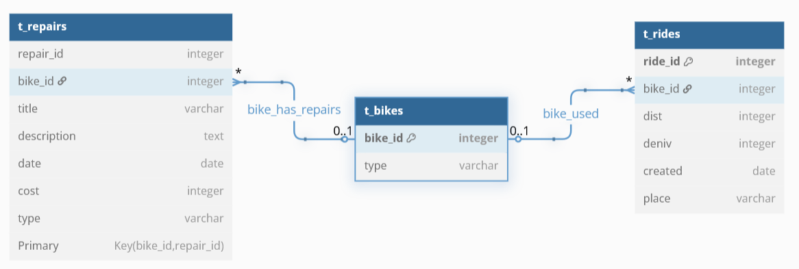

# CycloStats

CycloStats is a lightweight console-based application designed to help cyclists track their rides and manage bike maintenance efficiently.

## Features

- **Ride Tracking**
  - Log rides with distance, elevation gain, location, and date
  - Associate rides with specific bikes
  - View and analyze historical data

- **Bike Maintenance**
  - Manage multiple bikes
  - Record repair or maintenance events per bike
  - Track cost, description, and type of maintenance
  - Keep a history of service

- **Local Storage with SQLite**
  - Uses an embedded SQLite database
  - Fast, lightweight and requires no server
  - All data is saved locally (easy to back up or inspect)

## Tech stack

- **Language**: C++
- **Database**: SQLite
- **Schema**: Designed using [dbdiagram.io](https://dbdiagram.io)
- **Dependencies**: SQLite3 development libraries

## Database Schema


## Getting Started

1. Clone the repository:
   ```bash
   git clone https://github.com/Evann-404/CycloStats.git
   cd cyclostats
   ```
2. Build (requires SQLite3 development package):
   ```bash
   g++ -o cyclostats main.cpp -lsqlite3
   ./cyclostats
   ```
